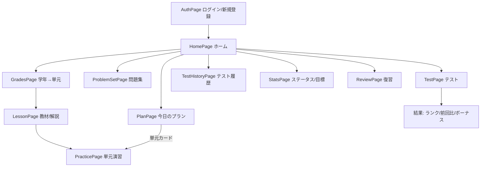

# まなびの広場 設計書

小学6年生〜中学1年生向けの算数・数学学習サービスの設計書。
RPG風のステータス成長でモチベーションを維持しながら継続学習を促す。

> セットアップ・環境変数・技術スタックは [README.md](./README.md) を参照。
> この文書はデータモデル・主要ロジック・API・画面遷移をまとめる。

---

## 1. 機能一覧

| 機能 | 概要 | 主な画面 |
|------|------|----------|
| 認証 | ユーザーID＋パスワードでログイン/新規登録 | AuthPage |
| ホーム | 各機能への入口。マスコットの応援メッセージ・今日のノルマ・目標までの距離・今日の一問・成長曲線・実績バッジ | HomePage |
| 教材（解説） | 単元ごとのMarkdown解説。初回読了で+5pt・既読✓ | LessonPage |
| 単元べつ演習 | 教材→「演習をはじめる」で1問ずつ即フィードバック | GradesPage → LessonPage → PracticePage |
| 問題集 | 学年の範囲を横断して連続演習（即FB・途中保存） | ProblemSetPage |
| テスト | 範囲を選び最後にまとめて採点（制限時間・ランク） | TestPage |
| テスト履歴 | 点数の推移グラフと結果一覧 | TestHistoryPage |
| 復習 | 直近の回答が不正解の問題をやり直す | ReviewPage |
| ステータス | 5種の学力・目標設定・参考ステータス | StatsPage |
| 今日のプラン | 目標から逆算した今日やるべき単元 | PlanPage |
| 成長曲線 | 実績＋目標ペースの折れ線 | HomePage（GrowthChart） |
| 今日のノルマ | 必要ポイント・進捗・連続学習日数 | HomePage（DailyQuotaCard） |

### ステータス（学力）の5種

| ステータス | 内容 |
|-----------|------|
| 計算力 | 四則演算・分数・小数の正確さと速さ |
| 数的センス | 数の性質・規則性・比の理解 |
| 図形力 | 図形の性質・面積・体積の理解 |
| 文章読解力 | 文章題を式に落とし込む力 |
| 論理力 | 順序立てて考え、式を組み立てる力 |

ステータスは `stat_types` テーブルで管理し、後から追加できる。

---

## 2. データモデル

```mermaid
erDiagram
    grades ||--o{ units : ""
    subjects ||--o{ units : ""
    stat_types ||--o{ units : ""
    units ||--o{ problems : ""
    units ||--o{ lesson_reads : ""
    problems ||--o{ choices : ""
    problems ||--o{ answer_records : ""
    students ||--o{ answer_records : ""
    students ||--o{ student_stats : ""
    students ||--o{ goals : ""
    students ||--o{ test_results : ""
    students ||--o{ lesson_reads : ""
    stat_types ||--o{ student_stats : ""
    stat_types ||--o{ goals : ""
    stat_types ||--o{ reference_stats : ""

    grades {
        string name
        int display_order
    }
    subjects {
        string name
    }
    stat_types {
        string name
        text description
        int display_order
    }
    units {
        string title
        text description
        text lesson_body "教材Markdown"
        int display_order
        fk grade_id
        fk subject_id
        fk stat_type_id "null許容"
    }
    problems {
        text question
        string answer
        text hint
        int difficulty "1-3"
        string problem_type "fill_in/multiple_choice"
        fk unit_id
    }
    choices {
        string text
        bool is_correct
        fk problem_id
    }
    students {
        string name
        string username "一意・ログインID"
        string password_digest "bcrypt"
    }
    answer_records {
        string submitted_answer
        bool is_correct
        fk student_id
        fk problem_id
    }
    student_stats {
        int value
        fk student_id
        fk stat_type_id
    }
    goals {
        int target_value
        date target_date
        fk student_id
        fk stat_type_id
    }
    reference_stats {
        string label
        int value
        fk stat_type_id
    }
    test_results {
        string scope_type "grade/stat_type/unit"
        int scope_id
        string scope_label
        int total_questions
        int correct_count
        int score_percent
        fk student_id
    }
    lesson_reads {
        fk student_id
        fk unit_id
    }
```

### テーブル補足

- **units.stat_type_id** … 単元がどのステータスを伸ばすか。`null` 許容（既存データ移行のため）。
- **student_stats** … `(student_id, stat_type_id)` で一意。現在値のみを持つ（履歴は持たない）。
- **goals** … `(student_id, stat_type_id)` で一意。目標値＋期限。
- **reference_stats** … 「数学の先生」「高校受験（公立）」「中学卒業レベル」などの参考値。`label` でグルーピング。
- **test_results** … テスト結果の履歴。`scope_type` は `grade | stat_type | unit`、`scope_id` はその対象ID。
- **problem.problem_type** … `fill_in`（記述）または `multiple_choice`（選択）。選択の場合のみ `choices` を持つ。
- **difficulty** … 1〜3。ポイント計算に使う。
- **students.username / password_digest** … 認証用。`username` は一意（ログインID）、`password_digest` は bcrypt（`has_secure_password`）。
- **units.lesson_body** … 単元の教材（Markdown）。フロントで `react-markdown` により描画。
- **lesson_reads** … 教材の読了記録。`(student_id, unit_id)` で一意。初回読了の判定＋既読表示に使う。

> 注: `student_stats` は現在値のみ保持。成長曲線の過去分は `answer_records` から再構築する（後述）。

---

## 3. 主要ロジック

### 3.0 認証・API保護

- アカウントは **ユーザーID（`username`）＋パスワード**。メールは扱わない。
- `has_secure_password`（bcrypt）でパスワードをハッシュ化。
- ログイン成功時に **署名トークン**を発行（`generates_token_for :auth`、30日有効、パスワード変更で自動失効）。
  フロントは localStorage に保存し、`Authorization: Bearer <token>` で送る。
- `ApplicationController#authenticate_request` が全APIでトークンを検証（`signup` / `login` のみ除外）。
- `/students/:id/*` は `StudentScoped` concern で **ログイン中の本人のみ**に制限（他人のIDは403）。
- `/answer_records` はリクエストの `student_id` を信用せず、ログイン中の本人に強制する。

### 3.1 ポイント加算（ステータス成長）

`AnswerRecord` 作成時、正解なら問題の単元に紐づくステータスへ加算する。

- 加算量は難易度依存: `POINTS_BY_DIFFICULTY = { 1 => 10, 2 => 15, 3 => 20 }`
- 実装: `AnswerRecord` の `after_create :update_student_stat, if: :is_correct?`
- 演習・問題集・テスト・復習すべて `AnswerRecord` を作るので、どのモードでも同じ経路でステータスが伸びる。
- 再挑戦でも毎回加算される（farming対策は "テストのボーナス" 側で行う。3.2参照）。

### 3.2 テスト採点とボーナス

`POST /students/:id/test_results` で回答を一括採点する。

1. 各回答について `AnswerRecord` を作成（→ 通常ポイントが自動加算）
2. 正解数から `score_percent`（0〜100）を算出
3. **自己ベスト判定**: 同じ範囲（`scope_type` + `scope_id`）の過去最高点と比較
4. **高得点ボーナス**（自己ベスト更新時のみ付与 = farming防止）
   - 90%以上 → +100pt / 80〜89% → +50pt
   - ボーナスはテストに出たステータスへ均等配分
5. `test_results` に保存し、`rank`・前回比較・`is_best` を返す

**ランク**: `S: 90%+ / A: 80%+ / B: 60%+ / C: 60%未満`

### 3.3 今日のノルマ（`GET /students/:id/quota`）

- **必要ポイント**: 各目標について `max(目標値 - 現在値, 0) / 残り日数`（残り日数で均等割り・切り上げ）を合計。目標未設定なら既定値 `30pt`。
- **今日の獲得ポイント**: 今日作成された正解 `AnswerRecord` の難易度ポイント合計。
- **目安の問題数**: `必要pt / 15`（切り上げ、最低1）。
- **連続学習日数（ストリーク）**: 回答があった日の連続数。今日やっていれば今日から、まだなら昨日から遡って数える。

### 3.4 成長曲線（`GET /students/:id/growth`）

- **実績（過去→現在）**: 正解 `AnswerRecord` を日付順に累積し、日ごとの累積ポイントを出す。最後に実際の現在値（ボーナス込み）を「現在」点として付ける。
- **目標ライン（現在→将来）**: 目標が設定されたステータスについて、`現在値 → 目標値` を目標日まで線形補間。将来のマイルストーン日（各目標の期限）で期待値を出す。
  - 合計ビュー: 全ステータスの期待値を合成した1本。
  - ステータス別ビュー: 目標があるステータスのみ点線を表示。
- フロントでは実線（実績）＋点線（目標ペース）を1本の時間軸に描画（`GrowthChart`）。

### 3.5 復習リスト（`GET /students/:id/review`）

- 各問題の「最新の `AnswerRecord`」が不正解の問題を返す（未解決の間違い一覧）。
- 実装: 問題ごとの最大 `id`（=最新）を取り、それが `is_correct = false` の問題を集める。
- 復習で正解すると新しい `AnswerRecord`（正解）ができ、次回はリストから外れる。

### 3.6 今日のプラン（`GET /students/:id/plan`）

- 各目標の「残りポイント ÷ 残り日数」で1日の必要ペースを算出。
- そのステータスに対応する単元を、正答率が低い（未着手優先）順に並べて「今日やること」として提示。

### 3.7 問題セットの動的抽出（`ProblemScope`）

- 範囲（`grade | stat_type | unit`）から対象単元を解決し、その問題を指定数ランダム抽出。
- 問題集・テストの両方がこの共通ロジックを使う（`GET /problem_set`）。

### 3.8 教材の読了と初回ポイント

- 単元の教材ページ（`LessonPage`）を開くと `POST /students/:id/lesson_reads` を呼ぶ。
- **初回のみ** `lesson_reads` を作成し、その単元のステータスへ **+5pt**（`LESSON_POINTS`）加算。
- 2回目以降は `{ awarded: false }` を返し、加点しない（読むだけ稼ぎの防止）。
- 既読の単元IDは `GET /students/:id/lesson_reads` で取得し、単元一覧に ✓ を表示。

### 3.9 ホームのモチベーション要素

- **応援メッセージ**: 時間帯・ノルマ達成状況・連続日数からフロントで文面を生成（マスコットが吹き出しで話す）。
- **今日の一問**: `GET /students/:id/daily_problem` がランダムな1問を返し、ホーム上でその場で解ける（`AnswerRecord` 経由で採点・加点）。
- **目標までの距離**: ステータス一覧から「残りポイントが最小の未達成目標」をフロントで求めて表示。
- **実績バッジ**: `GET /students/:id/achievements` が獲得条件（累計正解数・連続日数・テスト満点・教材読了数）を判定してバッジ一覧を返す。
- 連続学習日数は `Student#study_streak` に集約（ノルマ・実績で共用）。

---

## 4. API一覧

すべて `/api/v1` 配下。`signup` / `login` 以外は `Authorization: Bearer <token>` が必須。

| メソッド | パス | 説明 |
|----------|------|------|
| POST | `/signup` | 新規登録（name/username/password）→ トークン発行 |
| POST | `/login` | ログイン（username/password）→ トークン発行 |
| GET | `/me` | トークンから現在のユーザー |
| GET | `/students/:id` | 生徒情報（本人のみ） |
| GET | `/students/:id/stats` | ステータス一覧（目標込み） |
| PUT | `/students/:id/goals` | 目標の設定・更新 |
| GET | `/students/:id/progress` | 単元別の学習進捗 |
| GET | `/students/:id/plan` | 今日のプラン |
| GET | `/students/:id/quota` | 今日のノルマ・ストリーク |
| GET | `/students/:id/growth` | 成長曲線（実績＋目標） |
| GET | `/students/:id/review` | 復習リスト |
| GET | `/students/:id/test_results` | テスト履歴 |
| POST | `/students/:id/test_results` | テスト提出（採点） |
| GET | `/students/:id/lesson_reads` | 既読の単元ID一覧 |
| POST | `/students/:id/lesson_reads` | 教材読了（初回+5pt） |
| GET | `/students/:id/daily_problem` | 今日の一問（ランダム1問） |
| GET | `/students/:id/achievements` | 実績バッジ（獲得判定つき） |
| GET | `/grades` | 学年一覧（単元込み） |
| GET | `/units/:id` | 単元詳細（教材・問題込み） |
| POST | `/answer_records` | 回答送信（即採点＋ポイント加算） |
| GET | `/reference_stats` | 参考ステータス |
| GET | `/problem_set?scope_type=&scope_id=&count=` | 動的問題セット |

---

## 5. 画面遷移



- ログイン状態は `localStorage`（`token` / `studentId` / `studentName`）で保持。トークンは全APIに自動付与し、401で `/`（ログイン）へ戻す。
- 問題集の途中状態は `localStorage`（`problemset_<studentId>`）に保存し「続きから」再開。
- 開発中アクセス制限として、認証の外側に `PasswordGate`（あいことば）を通す。

---

## 6. フロント構成（主なコンポーネント）

| 種別 | ファイル | 役割 |
|------|----------|------|
| ページ | `pages/*.tsx` | 各画面（Auth / Home / Grades / Lesson / Practice / ProblemSet / Test / TestHistory / Review / Stats / Plan） |
| 共通 | `api/client.ts` | axios。トークン自動付与＋401ハンドリング |
| 共通 | `components/ProblemView.tsx` | 1問の表示（記述/選択）。演習・問題集・テスト・復習で共用 |
| 共通 | `components/GrowthChart.tsx` | 成長曲線（実線＋点線、合計/ステータス別タブ） |
| 共通 | `components/DailyQuotaCard.tsx` | 今日のノルマカード |
| 共通 | `components/MascotMessage.tsx` | 応援メッセージを話す手描き風マスコット |
| 共通 | `components/DailyProblemCard.tsx` | ホームで解ける「今日の一問」 |
| 共通 | `components/AchievementsRow.tsx` | 実績バッジ一覧 |
| 共通 | `components/ReferenceIcon.tsx` | 参考ステータスの手描き風SVGアイコン |
| 共通 | `components/PasswordGate.tsx` | 開発中アクセス制限 |
| API | `api/index.ts` | 全APIラッパー |
| 型 | `types/index.ts` | 共通型定義 |

---

## 7. 今後の拡張候補

- 教科の追加（現在は算数・数学。`subjects` で拡張可能な構造）
- ステータスの追加（`stat_types` にレコードを足すだけ）
- 途中保存のバックエンド永続化（現在は端末内 localStorage）
- テストの制限時間バリエーション、farming対策の精緻化
- ノルマ達成日連続（現在は「学習した日」の連続）
- 成長曲線のスナップショットテーブル化（現在は AnswerRecord から再構築）
- 認証の拡充（パスワードリセット・保護者アカウント・メール認証など。現在は ID+パスワードのコア認証のみ）
