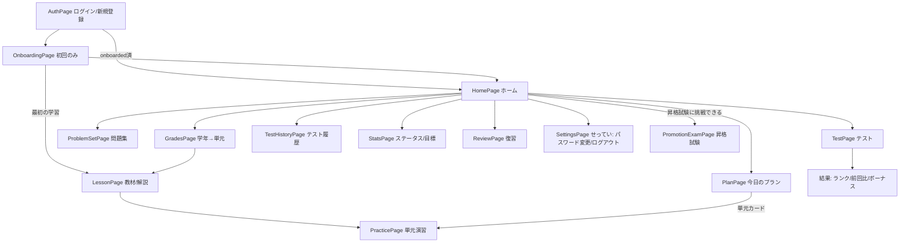

# まなびの広場 設計書

小学6年生〜中学1年生向けの算数・数学学習サービスの設計書。
RPG風のステータス成長でモチベーションを維持しながら継続学習を促す。

> セットアップ・環境変数・技術スタックは [README.md](./README.md) を参照。
> この文書はデータモデル・主要ロジック・API・画面遷移をまとめる。

---

## 1. 機能一覧

| 機能 | 概要 | 主な画面 |
|------|------|----------|
| 認証 | ユーザーID＋パスワードでログイン/新規登録 | AuthPage |
| オンボーディング | 初回のみ「ようこそ→目標を選ぶ→最初の学習」を案内 | OnboardingPage |
| 管理ページ（管理者のみ） | 単元/教材・問題・参考ステータスの編集、生徒の管理 | Admin* |
| ホーム | 各機能への入口。マスコットの応援・今日のノルマ・目標までの距離・目標達成のお祝い・今日の一問・成長曲線・実績バッジ | HomePage |
| 教材（解説） | 単元ごとのMarkdown解説。初回読了で+5pt・既読✓ | LessonPage |
| 単元べつ演習 | 教材→「演習をはじめる」で1問ずつ即フィードバック | GradesPage → LessonPage → PracticePage |
| 問題集 | 学年の範囲を横断して連続演習（即FB・途中保存） | ProblemSetPage |
| テスト | 範囲を選び最後にまとめて採点（制限時間・ランク） | TestPage |
| テスト履歴 | 点数の推移グラフと結果一覧 | TestHistoryPage |
| 復習 | 直近の回答が不正解の問題をやり直す | ReviewPage |
| ステータス | 5種の学力・目標サマリー・目標設定・参考ステータス・さびつき表示 | StatsPage |
| 今日のプラン | 目標から逆算した今日やるべき単元 | PlanPage |
| 成長曲線 | 実績＋目標ペースの折れ線 | HomePage（GrowthChart） |
| 今日のノルマ | 必要ポイント・進捗・連続学習日数 | HomePage（DailyQuotaCard） |
| 先生に聞く（生成AI） | その問題の文脈でClaudeがヒント・解き方・理由を返す（答えは丸投げしない・1日上限つき） | Practice/ProblemSet/Review/DailyProblem（AskTeacher） |

### ステータス（学力）の5種

| ステータス | 内容 |
|-----------|------|
| 計算力 | 四則演算・分数・小数の正確さと速さ |
| 数的センス | 数の性質・規則性・比の理解 |
| 図形力 | 図形の性質・面積・体積の理解 |
| 文章読解力 | 文章題を式に落とし込む力 |
| 論理力 | 順序立てて考え、式を組み立てる力 |

ステータスは `stat_types` テーブルで管理し、後から追加できる。

---

## 2. データモデル

```mermaid
erDiagram
    grades ||--o{ units : ""
    subjects ||--o{ units : ""
    stat_types ||--o{ units : ""
    units ||--o{ problems : ""
    units ||--o{ lesson_reads : ""
    problems ||--o{ choices : ""
    problems ||--o{ answer_records : ""
    students ||--o{ answer_records : ""
    students ||--o{ student_stats : ""
    students ||--o{ goals : ""
    students ||--o{ test_results : ""
    students ||--o{ lesson_reads : ""
    students ||--o{ ai_usages : ""
    students ||--o{ student_badges : ""
    ranks ||--o{ students : ""
    problems ||--o{ ai_usages : ""
    stat_types ||--o{ student_stats : ""
    stat_types ||--o{ goals : ""
    stat_types ||--o{ reference_stats : ""

    grades {
        string name
        int display_order
    }
    subjects {
        string name
    }
    stat_types {
        string name
        text description
        int display_order
    }
    units {
        string title
        text description
        text lesson_body "教材Markdown"
        int display_order
        bool active "無効化で出題除外"
        fk grade_id
        fk subject_id
        fk stat_type_id "null許容"
    }
    problems {
        text question
        string answer
        text hint
        int difficulty "1-5"
        string problem_type "fill_in/multiple_choice"
        bool active "無効化で出題除外"
        fk unit_id
    }
    choices {
        string text
        bool is_correct
        fk problem_id
    }
    students {
        string name
        string username "一意・ログインID"
        string password_digest "bcrypt"
        bool onboarded "初回案内ずみ"
        bool admin "管理者"
        fk rank_id "現在の総合ランク（null=最下位）"
        int last_exam_points "昇格試験に落ちた時点の合計pt"
        string title_key "選択中の称号（バッジのkey）"
    }
    ranks {
        string name "10級〜初段"
        int threshold_points "到達に要る合計pt"
        int exam_question_count "昇格試験の問題数"
        int pass_percent "合格ライン(%)"
        int display_order
    }
    student_badges {
        string badge_key
        datetime earned_at
        fk student_id
    }
    answer_records {
        string submitted_answer
        bool is_correct
        int points_awarded "回答時に確定した獲得pt"
        fk student_id
        fk problem_id
    }
    student_stats {
        int value
        fk student_id
        fk stat_type_id
    }
    goals {
        int target_value
        date target_date
        fk student_id
        fk stat_type_id
    }
    reference_stats {
        string label
        int value
        fk stat_type_id
    }
    test_results {
        string scope_type "grade/stat_type/unit/promotion"
        int scope_id
        string scope_label
        int total_questions
        int correct_count
        int score_percent
        int bonus_points "高得点ボーナス（成長曲線で合算）"
        fk student_id
    }
    lesson_reads {
        fk student_id
        fk unit_id
    }
    ai_usages {
        string kind "hint/approach/why/free"
        fk student_id
        fk problem_id "null許容"
    }
```

### テーブル補足

- **units.stat_type_id** … 単元がどのステータスを伸ばすか。`null` 許容（既存データ移行のため）。
- **student_stats** … `(student_id, stat_type_id)` で一意。現在値のみを持つ（履歴は持たない）。
- **goals** … `(student_id, stat_type_id)` で一意。目標値＋期限。
- **reference_stats** … 目標の目安（参考値）。`label` でグルーピング。中学卒業レベル/高校受験（公立）/難関高校受験/数学の先生/エンジニア/研究者/ゲームクリエイター など。
- **test_results** … テスト結果の履歴。`scope_type` は `grade | stat_type | unit`（選べる範囲）に加え、昇格試験の記録用に `promotion`（`scope_id` はランクID）。`SCOPE_TYPES` は選べる範囲、`RECORDED_SCOPE_TYPES` は保存されうる範囲。
  `bonus_points` は高得点ボーナス（自己ベスト更新時のみ）。成長曲線でこの値も合算する。
- **answer_records.points_awarded** … その回答で実際に入ったポイント。解き直しの逓減を含めて
  **回答時に確定**させる（3.13）。今日のノルマ・成長曲線はこの列をSUMするだけでよい。
- **problem.problem_type** … `fill_in`（記述）または `multiple_choice`（選択）。選択の場合のみ `choices` を持つ。
- **difficulty** … 1〜5。ポイント計算に使う（満点は 10/15/20/25/30pt）。
- **students.username / password_digest** … 認証用。`username` は一意（ログインID）、`password_digest` は bcrypt（`has_secure_password`）。
- **students.onboarded** … 初回オンボーディング済みか。`false` の間だけウィザードを表示。
- **students.admin** … 管理者か。`ADMIN_USERNAME` 環境変数のユーザーを seed が管理者にする。
- **units.active / problems.active** … 無効化フラグ。`false` は新しい出題（演習・問題集・テスト・今日の一問・復習・単元一覧）から除外。回答履歴は保持。
- **units.lesson_body** … 単元の教材（Markdown）。フロントで `react-markdown` により描画。
- **lesson_reads** … 教材の読了記録。`(student_id, unit_id)` で一意。初回読了の判定＋既読表示に使う。
- **ai_usages** … 「先生に聞く」（生成AI）の利用ログ。1レコード＝1回の質問。`(student_id, created_at)` に索引を張り、その日の利用回数を数えてレート制限に使う。`problem_id` は文脈にした問題（削除されても残せるよう `null` 許容）。`kind` は `hint / approach / why / free`。

- **ranks** … 総合ランクの定義（10級〜初段の11段階）。しきい値と昇格試験のパラメータを持つ。
  seed で `display_order` をキーに更新するので、調整は seed の書き換えだけで効く。
- **students.rank_id** … 現在の総合ランク。**`null` は「最下位ランク」**として扱う（`Student#current_rank`）。
  こうすることで既存生徒のバックフィルが要らない。
- **students.last_exam_points** … 昇格試験に落ちた時点の合計ポイント。ここから
  `PromotionExam::RETRY_POINTS` 伸ばすと再挑戦できる。合格すると `null` に戻る。
- **student_badges** … 獲得したバッジの記録。`(student_id, badge_key)` で一意。
  **定義そのものはコード側（`BadgeCatalog`）**にある（条件が「連続日数」「単元制覇」
  「直近20問の正答率」など列で表せないため）。ここに残すのは獲得した事実と日時だけで、
  それがないと「今まさに取った」瞬間を検出できずお祝いが出せない。
- **students.title_key** … 選択中の称号。称号を持つバッジの `key` を指す。
  バッジ未獲得なら名乗れない（`Student#title` が `null` を返す）。

> 注: `student_stats` は現在値のみ保持。成長曲線の過去分は履歴テーブル
> （`answer_records` ＋ `test_results.bonus_points` ＋ `lesson_reads`）から再構築する（3.4）。

---

## 3. 主要ロジック

### 3.0 認証・オンボーディング・API保護

- アカウントは **ユーザーID（`username`）＋パスワード**。メールは扱わない。
- `has_secure_password`（bcrypt）でパスワードをハッシュ化。
- ログイン成功時に **署名トークン**を発行（`generates_token_for :auth`、30日有効、パスワード変更で自動失効）。
  フロントは localStorage に保存し、`Authorization: Bearer <token>` で送る。
- `ApplicationController#authenticate_request` が全APIでトークンを検証（`signup` / `login` のみ除外）。
- `/students/:id/*` は `StudentScoped` concern で **ログイン中の本人のみ**に制限（他人のIDは403）。
- `/answer_records` はリクエストの `student_id` を信用せず、ログイン中の本人に強制する。

**パスワードの再発行（管理者）**: メールを扱わないので「本人確認メールを送る」方式は取れない。
代わりに **管理者（保護者）が再発行する**。`POST /admin/students/:id/reset_password` が
`Student.generate_password` で新しいパスワードを作り、**その応答でだけ平文を返す**
（保存はハッシュのみなので、あとから取り出す手段はない）。管理画面は一度だけ表示する。
- 生成規則: 8文字・英小文字＋数字。**紛らわしい `l` `i` `o` `0` `1` は使わない**（子どもが読み間違える）。
- アカウント削除と違い、**回答履歴・ステータスは残る**。忘れた子を消さずに救済できる。

**パスワードの変更（本人）**: `PUT /students/:id/password`。いまのパスワードの一致を必須にする
（トークンを盗まれても勝手に変えられないため）。最低4文字（`Student` のバリデーションと同じ）。

- パスワードが変わると `generates_token_for :auth` の署名（`password_salt` を含む）が変わり、
  **発行済みトークンは自動的に失効する**。つまり再発行すると、その子の他端末のログインも切れる。
- 自分で変えた場合はそのまま使い続けたいので、変更APIの応答で**新しいトークンを返し**、
  フロントは localStorage の `token` を差し替える（＝ログアウトされない）。

**オンボーディング**: `onboarded=false` の間だけ初回ウィザード（`/onboarding`）を表示。
- 遷移: 新規登録直後は `/onboarding`、ログイン時は `onboarded ? /home : /onboarding`（認証レスポンスの `onboarded` で判定）。
- 3ステップ: ①ようこそ ②参考ステータスから目標を選ぶ（既存 `PUT goals` を流用・期限は3ヶ月後）③おすすめ単元（プラン先頭）の教材へ。
- 完了/スキップで `POST /students/:id/complete_onboarding` → `onboarded=true`。各ステップはスキップ可。

### 3.1 ポイント加算（ステータス成長）

`AnswerRecord` 作成時、正解なら問題の単元に紐づくステータスへ加算する。

- 満点は難易度依存: `POINTS_BY_DIFFICULTY = { 1 => 10, 2 => 15, 3 => 20, 4 => 25, 5 => 30 }`
- 実装: `AnswerRecord` の `after_create :update_student_stat, if: :is_correct?`
- 演習・問題集・テスト・復習すべて `AnswerRecord` を作るので、どのモードでも同じ経路でステータスが伸びる。
- **同じ問題の解き直しは減額される**（farming対策。3.13参照）。

**ポイントは回答時に確定し `answer_records.points_awarded` に保存する。**
「何回目か」「前回正解から何日か」に依存するルールなので、あとから再計算すると
過去の成長曲線まで書き変わってしまう。読み出し側（今日のノルマ・成長曲線）はこの列を
SUM するだけでよく、ロジックが `AnswerRecord` の1箇所に集約される。

### 3.2 テスト採点とボーナス

`POST /students/:id/test_results` で回答を一括採点する。

1. 各回答について `AnswerRecord` を作成（→ 通常ポイントが自動加算）
2. 正解数から `score_percent`（0〜100）を算出
3. **自己ベスト判定**: 同じ範囲（`scope_type` + `scope_id`）の過去最高点と比較
4. **高得点ボーナス**（自己ベスト更新時のみ付与 = farming防止）
   - 90%以上 → +100pt / 80〜89% → +50pt
   - ボーナスはテストに出たステータスへ均等配分
5. `test_results` に保存し、`rank`・前回比較・`is_best` を返す
   （ボーナス額は `test_results.bonus_points` に記録する。成長曲線で合算するため）

**ランク**: `S: 90%+ / A: 80%+ / B: 60%+ / C: 60%未満`

### 3.3 今日のノルマ（`GET /students/:id/quota`）

- **必要ポイント**: 各目標について `max(目標値 - 現在値, 0) / 残り日数`（残り日数で均等割り・切り上げ）を合計。目標未設定なら既定値 `30pt`。
- **今日の獲得ポイント**: 今日の `answer_records.points_awarded` の合計。
- **上限クリップ**: 必要ポイントは「今日満点で解ける問題の合計」を超えない（3.13）。
  ゼロなら `exhausted: true` を返し、フロントは「やりきった」表示に切り替える。
- **目安の問題数**: `必要pt / 15`（切り上げ、最低1）。
- **連続学習日数（ストリーク）**: 回答があった日の連続数。今日やっていれば今日から、まだなら昨日から遡って数える。

### 3.4 成長曲線（`GET /students/:id/growth`）

- **実績（過去→現在）**: ポイントの出どころ**3系統すべて**を日付順に累積する。最後に現在値（`student_stats`）を「現在」点として付ける。
  1. 問題の正解 … `answer_records.points_awarded`
  2. テストの高得点ボーナス … `test_results.bonus_points`（配分先は範囲のステータスから復元）
  3. 教材の初回読了 … `lesson_reads`（1件 = `LessonRead::POINTS`）

  > どれかを落とすと折れ線が実際より低く伸び、最後の「現在」だけが跳ね上がる。
  > 以前はボーナスと読了が抜けていたため段差が出ていた。
- **目標ライン（現在→将来）**: 目標が設定されたステータスについて、`現在値 → 目標値` を目標日まで線形補間。将来のマイルストーン日（各目標の期限）で期待値を出す。
  - 合計ビュー: 全ステータスの期待値を合成した1本。
  - ステータス別ビュー: 目標があるステータスのみ点線を表示。
- フロントでは実線（実績）＋点線（目標ペース）を1本の時間軸に描画（`GrowthChart`）。

### 3.5 復習リスト（`GET /students/:id/review`）

- 各問題の「最新の `AnswerRecord`」が不正解の問題を返す（未解決の間違い一覧）。
- 実装: 問題ごとの最大 `id`（=最新）を取り、それが `is_correct = false` の問題を集める。
- 復習で正解すると新しい `AnswerRecord`（正解）ができ、次回はリストから外れる。

### 3.6 今日のプラン（`GET /students/:id/plan`）

- 各目標の「残りポイント ÷ 残り日数」で1日の必要ペースを算出。
- そのステータスに対応する単元を提示。並び順は **未読の解説を先** → 正答率が低い順（学ぶ→やるの流れ）。
- 各単元に `lesson_read` を返し、フロントは未読なら「📖 まず解説」（→教材ページ）、既読なら「✓ 解説ずみ」（→演習）へ導線を出し分ける。

### 3.7 問題セットの動的抽出（`ProblemScope`）

- 範囲（`grade | stat_type | unit`）から対象単元を解決し、その問題を指定数ランダム抽出。
- 問題集・テストの両方がこの共通ロジックを使う（`GET /problem_set`）。

### 3.8 教材の読了と初回ポイント

- 単元の教材ページ（`LessonPage`）を開くと `POST /students/:id/lesson_reads` を呼ぶ。
- **初回のみ** `lesson_reads` を作成し、その単元のステータスへ **+5pt**（`LESSON_POINTS`）加算。
- 2回目以降は `{ awarded: false }` を返し、加点しない（読むだけ稼ぎの防止）。
- 既読の単元IDは `GET /students/:id/lesson_reads` で取得し、単元一覧に ✓ を表示。

#### 教材の数式（KaTeX）と図

教材本文（`units.lesson_body`）は Markdown ＋ **KaTeX** で書く。`MarkdownView` が
`remark-math` → `rehype-katex` で描画する。分数・ルート・累乗をきれいに組版でき、
算数・数学の教材として読みやすくなる。

- **インライン**: `$\frac{2}{3} \times \frac{3}{4}$`
- **別行立て**（大きく中央寄せ）: `$$` を**独立した行**に書く。
  1行に `$$...$$` と書くとインライン扱いになり大きくならない。
- **図**: Markdown の `` で貼る。`.lesson-body img` で画面幅に収める。
- 長い数式は `.katex-display` を横スクロールさせ、ページ全体は横に伸ばさない。

> ⚠️ **seeds.rb のヒアドキュメントは必ずリテラル（`<<~'MD'`）にする。**
> 補間あり（`<<~MD`）だと `\frac` が改ページ文字、`\times` がタブに化けて数式が壊れる。

#### 問題文の数式

問題文・選択肢・ヒント（`problems.question` / `choices.text` / `problems.hint`）も
`$...$` で数式にできる。描画は `MathText`（Markdownは解釈しない軽量版）。
テストを含む問題画面すべてに効く。

- **表示だけを数式化する。** 答え合わせは `problems.answer` の平文比較のままなので、
  判定ロジックは一切変わらない。
- **入力の書き方の説明は数式にしない。** 「（分数は a/b の形で答えること）」
  「（スペースなし、例: 6x-12）」などは、子どもが実際にキーボードで打つ形。
  数式で組むと打つべき文字と見た目がずれるので平文のままにする。
- **比（`3 : 4 = 9 : □`）や単位つきの文章題は平文のまま。** 全角のままで十分読める。

> ⚠️ **seeds.rb の問題文で LaTeX を書くときは Ruby のシングルクォートを使う。**
> `"$\frac{2}{3}$"` はダブルクォートなので `\f` が改ページ文字に化ける。
> `'$\frac{2}{3}$'` と書くこと。

### 3.9 ホームのモチベーション要素

- **応援メッセージ**: 時間帯・ノルマ達成状況・連続日数からフロントで文面を生成（マスコットが吹き出しで話す）。
- **今日の一問**: `GET /students/:id/daily_problem` がランダムな1問を返し、ホーム上でその場で解ける（`AnswerRecord` 経由で採点・加点）。
- **目標までの距離**: ステータス一覧から「残りポイントが最小の未達成目標」をフロントで求めて表示。
- **実績バッジ**: `GET /students/:id/achievements` が獲得条件（累計正解数・連続日数・テスト満点・教材読了数）を判定してバッジ一覧を返す。
- 連続学習日数は `Student#study_streak` に集約（ノルマ・実績で共用）。

### 3.10 目標の達成とお祝い

- **達成判定**: ステータスの現在値 ≥ 目標値。フロントで判定（新エンドポイント不要）。
- **お祝い**: ホームに達成バナーを表示し、「次の目標を決める」→ ステータス画面の参考カードで目標を選び直す（オンボーディングと同じ発想）。一度閉じた達成は localStorage（`celebrated`）で記憶し再表示しない。
- **目標サマリー**: ステータス画面の上部に、目標を設定している各ステータスの進捗（現在/目標・達成✓/あと○pt・期限）を一覧表示。

### 3.11 さびつき（コンディション）

- earned値（`student_stats`）は**変更しない**。ポイント・成長曲線・ノルマは無関係。
- **最後に学習した日**（`answer_records` の最新）からの未学習日数で「さびつき%」を計算：
  `rust = clamp((未学習日数 − 3) × 2, 0, 20)`（学習未経験なら0）。今日1問でも解けば0に回復。
- `GET /students/:id/condition` が `{ rust_percent, idle_days, last_studied_on }` を返す。
- 表示は**ナッジのみ**：ステータス画面にバナー＋バーを暗く（数字は下げない）、ホームに小さな休止の合図。「実力の記録は消えない」ことを明記。

### 3.12 管理（admin）

- 管理者は `students.admin`。`ADMIN_USERNAME` のユーザーを seed が管理者にする。認証レスポンスに `admin` を含める。
- 管理APIは `/api/v1/admin/*`（`AdminOnly` concern で `admin` 以外は403）。フロント `/admin/*` は管理者以外ホームへリダイレクト。
- **削除は未使用のみ**（回答履歴のある問題・単元は削除不可 → 無効化で対応）。参考ステータス・生徒は削除可（管理者自身は不可）。
- 管理機能: 単元/教材（追加・編集・無効化・削除）、問題（追加・編集・選択肢編集・無効化・削除）、参考ステータス（CRUD）、生徒（一覧・状況・削除）。

### 3.13 先生に聞く（生成AI連携）

問題を解く画面で「先生に聞く」→ **その問題の文脈つき**で Claude がヒント・解き方・理由を返す（`AskTeacher` コンポーネント）。

- **経路**：APIキーは絶対にフロントに出さない。フロント → Railsバックエンド（`ClaudeTeacher` サービスが `Net::HTTP` で Claude API を呼ぶ） → 返答。キーは環境変数 `ANTHROPIC_API_KEY` のみ。
- **モデル/コスト**：既定は `claude-haiku-4-5`（速い・安い）。`ANTHROPIC_MODEL` でコードを触らず差し替え可。返答は `AI_MAX_TOKENS`（既定400≒日本語200〜300字）で短く。
- **安全ガードレール**（システムプロンプトで固定）：①その問題についてだけ答える ②**最終的な数値の答えは言わない**（丸投げしない・考え方に誘導） ③小中学生向けにやさしく・範囲を超えない ④学習と無関係な質問はやさしく断る ⑤短く・励ます口調。
- **レート制限**：`ai_usages` にログを残し、1人あたり **1日 `AI_DAILY_LIMIT`（既定20）回**まで。上限到達時は消費せず「今日はここまで！また明日ね」。**成功時のみ**回数を消費する（APIエラーで無駄に減らさない）。
- **UI**：`Practice / ProblemSet / Review / DailyProblem` の4画面に共通コンポーネントで設置。**テスト画面には出さない**（実力測定のため）。プリセット（ヒント/解き方/なぜ？）＋自由入力。返答は都度1回・ストリーミングなし（「先生が考え中…」表示）。パネルに「今日はあと○回」を表示。
- **返答の数式**：問題文が数式化ずみなので、先生の返答にも分数が出る。システムプロンプトで
  **記法を「行内の `$...$` のみ・Markdown禁止」に固定**し、フロントは `MathText` で描画する。
  `$$` や `**太字**` が来た場合に備え、`AskTeacher` 側で `$$`→`$`・`**`除去の正規化をかける
  （生成AIなので指示が外れることがある。問題文の描画には手を入れない）。

### 3.14 farming対策と出題の重複回避

ポイントはこのアプリの背骨（ポイント → ステータス → 目標・成長曲線・ノルマ・実績）なので、
同じ問題を繰り返して稼げてしまうと、その上に乗る機能すべての意味が薄くなる。
**「前回正解から14日」という1つの基準で、加点と出題の両方を制御する。**

#### 加点（`AnswerRecord`）

| 状況 | ポイント |
|------|----------|
| 初回の正解 | 満点 |
| 前回正解から **14日未満** の解き直し | **満点の20%**（最低1pt） |
| 前回正解から **14日以上** あいた解き直し | 満点に復帰 |
| 不正解 | 0pt |

14日あければ満点に戻るのは意図的。忘れた頃の復習は farming ではなく正しい勉強なので、
評価されるべきという考え方（間隔反復）。定数は `REPEAT_RATE` / `RECOVERY_DAYS`。

減額されたことは回答フィードバックで必ず伝える（`is_repeat`）。黙って減ると不具合に見えるため。

#### 出題（`ProblemScope#sample_problems_for`）

次の優先度で埋め、足りなければ下の層へ落ちる。各層の中はシャッフル。

1. **未挑戦**
2. 最新の回答が**不正解**（＝復習すべき問題）
3. 正解済みで**14日経過**（満点に復帰している）
4. 正解済みで**14日以内**（最後の手段。加点も20%）

適用範囲:

| 画面 | 重複回避 | 理由 |
|------|----------|------|
| 問題集（`mode=practice`） | ✅ | 練習なので解けない問題を優先すべき |
| 今日の一問 | ✅ | 毎日同じ問題が出るのを防ぐ |
| テスト | ❌ ランダムのまま | 実力測定。解ける問題を除くと点が実態より高く出て、履歴の比較もできない |
| 単元べつ演習 | ❌ 全問を順に | 「この単元をやる」が目的 |
| 復習 | ❌ | 定義上すべて再挑戦（加点は上表に従う） |

#### 今日のノルマとの関係

問題数が少ないうちは「全問を最近やりきった」状態になりうる。そのとき満点で取れる問題は
ゼロなので、ノルマをそのまま出すと**達成不能なノルマを毎日提示する**ことになり、
逓減した20%を大量に解かせる——つまり止めたいはずの farming を促してしまう。

そこで `target_points` を**今日満点で解ける問題の合計**でクリップし、
ゼロなら `exhausted: true` を返して「やりきった」表示に切り替える
（「少し時間がたつと○問が復習としてもどってくるよ」）。
なお連続学習日数は「回答した日」で判定しているので、この状態でも途切れない。

---

### 3.15 総合ランクと昇格試験

目標（ステータスごと・150〜500pt）は遠い。**あいだにランクを置いて、達成感を刻む。**

- **単位は総合ランク1本**。全ステータスの合計ポイントで判定する（`Student#total_points`）。
  ステータス別の目標はそのまま残す。
- **11段階**: 10級 → 1級 → 初段。しきい値は 0 / 30 / 80 / 150 / 250 / 400 / 600 / 850 / 1150 / 1500 / 2000pt。
  最初の昇格が2〜3問で来るので、始めてすぐ成功体験がある。参考目標の合計が500〜1750ptなので、
  その道中に昇格イベントが並ぶ。
- **到達しただけでは上がらない。昇格試験に合格して初めて昇格する。**
- **降格はしない**。さびつきは表示だけで earned 値を守る方針と揃える。

**昇格試験**（`PromotionExam`）

| 項目 | 内容 |
|------|------|
| 出題範囲 | **その子が学んだ単元**（回答履歴のある単元。`ProblemScope.learned_by`） |
| 問題数 | `ranks.exam_question_count`（既定10。範囲の問題が少なければその数） |
| 合格 | `ranks.pass_percent`（既定80%）以上 |
| 制限時間 | なし |
| 報酬 | ランクが上がること。**テストの高得点ボーナスは付けない**（`BONUS_POINTS = 0`） |
| 記録 | `test_results` に `scope_type: "promotion"` で残る（テスト履歴に「昇格試験（9級）」） |

出題範囲を学年ではなく**学習履歴**で絞っているのは、生徒に学年を持たせていないため。
学年で縛るより正確でもある（先取りした分は範囲に入り、まだ触っていない領域は出ない）。

**落ちたときの再挑戦**: 不合格時点の合計ポイントを `students.last_exam_points` に記録し、
そこから `RETRY_POINTS`（20pt）伸ばすと再挑戦できる。待ち時間も連打もなく、
「落ちた → 少し学習 → もう一度」のループになる。

> ⚠️ **スナップショットは採点が終わって加点が反映されたあとに取ること。**
> 昇格試験の回答も `AnswerRecord` を通るのでポイントが入る。先に取ると試験自身の得点で
> 条件を満たしてしまい、落ちた直後に再挑戦できてしまう。

> 補足: 同じ理由で、試験の得点が次のランクの到達条件を押し上げるため、合格後にそのまま
> 次の試験へ進めることがある。ただし解き直しは満点の20%しか入らないので連鎖は必ず止まる
> （実測: 1単元9問だけの学習で 7級／184pt で頭打ち）。

### 3.16 実績バッジと称号

- **バッジは15種**。累計正解数・連続日数・正答率・単元制覇・教材読了・復習ゼロ・ランク到達をカバーする。
- **定義はコード側（`BadgeCatalog`）**。条件が列で表せないため。DBに残すのは獲得した事実（`student_badges`）。
- **獲得日時を残すのは、取った瞬間を検出してお祝いを出すため。**
  `GET /achievements` は判定をやり直したうえで、新規獲得ぶんを `newly_earned` で返す。
  一度返すと保存されるので、リロードしても二度は祝わない。
- **称号**は「称号つきバッジ」を獲得するとアンロックされ、その中から**1つ選んで**ホームに表示する
  （`students.title_key`）。未獲得の称号は名乗れない。ランク到達バッジに称号を付けていないのは、
  ランク自体が別枠で表示されるため。

---

## 4. API一覧

すべて `/api/v1` 配下。`signup` / `login` 以外は `Authorization: Bearer <token>` が必須。

| メソッド | パス | 説明 |
|----------|------|------|
| POST | `/signup` | 新規登録（name/username/password）→ トークン発行 |
| POST | `/login` | ログイン（username/password）→ トークン発行 |
| GET | `/me` | トークンから現在のユーザー |
| GET | `/students/:id` | 生徒情報（本人のみ） |
| PUT | `/students/:id/password` | パスワード変更（本人。いまのパスワード必須・新トークンを返す） |
| POST | `/students/:id/complete_onboarding` | オンボーディング完了（`onboarded=true`） |
| GET | `/students/:id/stats` | ステータス一覧（目標込み） |
| PUT | `/students/:id/goals` | 目標の設定・更新 |
| GET | `/students/:id/progress` | 単元別の学習進捗 |
| GET | `/students/:id/plan` | 今日のプラン |
| GET | `/students/:id/quota` | 今日のノルマ・ストリーク |
| GET | `/students/:id/growth` | 成長曲線（実績＋目標） |
| GET | `/students/:id/review` | 復習リスト |
| GET | `/students/:id/test_results` | テスト履歴 |
| POST | `/students/:id/test_results` | テスト提出（採点） |
| GET | `/students/:id/lesson_reads` | 既読の単元ID一覧 |
| POST | `/students/:id/lesson_reads` | 教材読了（初回+5pt） |
| GET | `/students/:id/daily_problem` | 今日の一問（ランダム1問） |
| GET | `/students/:id/achievements` | 実績バッジ（獲得判定・獲得日時・新規獲得・称号の選択肢） |
| PUT | `/students/:id/title` | 称号を選ぶ／外す（未獲得は422） |
| GET | `/students/:id/rank` | 総合ランクの状況（次まで何pt・昇格試験に挑戦できるか） |
| GET | `/students/:id/promotion_exam` | 昇格試験の問題を取り出す（挑戦できないときは422） |
| POST | `/students/:id/promotion_exam` | 昇格試験の提出（採点＋昇格判定） |
| GET | `/students/:id/condition` | さびつき状態（未学習日数から算出） |
| GET | `/students/:id/ai_usage` | 「先生に聞く」の今日の利用状況（used/limit/remaining） |
| POST | `/students/:id/ask_teacher` | その問題の文脈で先生に質問（problem_id/kind/question） |
| GET | `/grades` | 学年一覧（単元込み） |
| GET | `/units/:id` | 単元詳細（教材・問題込み） |
| POST | `/answer_records` | 回答送信（即採点＋ポイント加算） |
| GET | `/reference_stats` | 参考ステータス |
| GET | `/problem_set?scope_type=&scope_id=&count=&mode=` | 動的問題セット（`mode=practice` で重複回避つき／未指定はランダム＝テスト用） |
| POST | `/admin/students/:id/reset_password` | パスワード再発行（管理者。平文はこの応答でだけ返す） |
| — | `/admin/*`（管理者のみ） | meta / units / problems / reference_stats / students のCRUD |

---

## 5. 画面遷移

```mermaid
flowchart TD
    Auth["AuthPage ログイン/新規登録"] --> Onb["OnboardingPage 初回のみ"]
    Auth -->|onboarded済| Home["HomePage ホーム"]
    Onb --> Home
    Onb -->|最初の学習| Lesson
    Home --> Plan["PlanPage 今日のプラン"]
    Home --> Grades["GradesPage 学年→単元"]
    Grades --> Lesson["LessonPage 教材/解説"]
    Lesson --> Practice["PracticePage 単元演習"]
    Home --> PSet["ProblemSetPage 問題集"]
    Home --> Test["TestPage テスト"]
    Test --> TestResult["結果: ランク/前回比/ボーナス"]
    Home --> History["TestHistoryPage テスト履歴"]
    Home --> Stats["StatsPage ステータス/目標"]
    Home --> Review["ReviewPage 復習"]
    Home --> Settings["SettingsPage せってい: パスワード変更/ログアウト"]
    Home -->|昇格試験に挑戦できる| Exam["PromotionExamPage 昇格試験"]
    Plan -->|単元カード| Practice
```

- ログイン状態は `localStorage`（`token` / `studentId` / `studentName`）で保持。トークンは全APIに自動付与し、401で `/`（ログイン）へ戻す。
- 問題集の途中状態は `localStorage`（`problemset_<studentId>`）に保存し「続きから」再開。
- 開発中アクセス制限として、認証の外側に `PasswordGate`（あいことば）を通す。

---

## 6. フロント構成（主なコンポーネント）

| 種別 | ファイル | 役割 |
|------|----------|------|
| ページ | `pages/*.tsx` | 各画面（Auth / Onboarding / Home / Grades / Lesson / Practice / ProblemSet / Test / TestHistory / Review / Stats / Plan / Settings） |
| ページ | `pages/SettingsPage.tsx` | せってい。パスワード変更（新トークンを保存し直す）とログアウト |
| 共通 | `components/Mascot.tsx` | 手描き風マスコット（ホーム・オンボーディングで共用） |
| 共通 | `api/client.ts` | axios。トークン自動付与＋401ハンドリング |
| 共通 | `components/ProblemView.tsx` | 1問の表示（記述/選択）。演習・問題集・テスト・復習で共用 |
| 共通 | `components/GrowthChart.tsx` | 成長曲線（実線＋点線、合計/ステータス別タブ） |
| 共通 | `components/DailyQuotaCard.tsx` | 今日のノルマカード |
| 共通 | `components/MascotMessage.tsx` | 応援メッセージを話す手描き風マスコット |
| 共通 | `components/DailyProblemCard.tsx` | ホームで解ける「今日の一問」 |
| 共通 | `components/AchievementsRow.tsx` | 実績バッジ一覧 |
| 共通 | `components/RankCard.tsx` | 総合ランク・称号・昇格試験への導線（ホームとステータスで共用） |
| ページ | `pages/PromotionExamPage.tsx` | 昇格試験（説明→出題→合否）。範囲も問題数も選べない |
| 共通 | `components/AskTeacher.tsx` | 「先生に聞く」（生成AI）。問題を解く4画面で共用（テストは除く） |
| 共通 | `components/MarkdownView.tsx` | Markdown＋数式（KaTeX）の描画。教材ページで使用 |
| 共通 | `components/MathText.tsx` | 問題文・選択肢・ヒント内の `$...$` だけを数式化（Markdownは解釈しない軽量版） |
| サービス | `services/claude_teacher.rb` | Claude API を `Net::HTTP` で呼ぶ（バックエンド。キーは環境変数） |
| 共通 | `sound.ts` | 効果音（Web Audio APIで合成、音源不要／正解・不正解・完了）＋ BGM（`public/bgm.mp3` をループ）。ホームでそれぞれオン/オフ |
| 共通 | `components/ReferenceIcon.tsx` | 参考ステータスの手描き風SVGアイコン |
| 共通 | `components/PasswordGate.tsx` | 開発中アクセス制限 |
| API | `api/index.ts` | 全APIラッパー |
| 型 | `types/index.ts` | 共通型定義 |

### バンドル分割（初回JSを軽くする）

`App.tsx` で `React.lazy` により、重い/使う人が限られる画面を別チャンクにしている。
`<Suspense>` のフォールバックは既存の「読み込み中...」表示。

| 遅延読み込み | 理由 |
|--------------|------|
| `LessonPage` | `react-markdown` と KaTeX が重い。教材を開いたときだけ読み込む |
| `PracticePage` / `ProblemSetPage` / `TestPage` / `ReviewPage` | 問題文の数式で KaTeX を使う。ログイン直後には要らない |
| `DailyProblemCard`（ホーム内） | 同上。ホームの初期表示をブロックさせない |
| `admin/*`（5画面） | 管理者しか使わない。生徒には読み込ませない |

初回JS **487kB → 332kB**（gzip 148→105kB）。KaTeXを2箇所で使いながら軽くなっている。

> KaTeX を `manualChunks` で共有チャンクに切り出すのも試したが不採用。各チャンクは
> 使う分だけ tree-shaking されており、共有化すると単一画面しか開かない利用者の転送量が
> 増えた（問題画面のみ: 591→851kB）。両方開く場合の合計はほぼ同じ（982 vs 983kB）。

---

## 7. 今後の拡張候補

- 教科の追加（現在は算数・数学。`subjects` で拡張可能な構造）
- ステータスの追加（`stat_types` にレコードを足すだけ）
- ランクの管理画面（今は seed のみ。しきい値・合格ラインを画面から変えられるように）
- 途中保存のバックエンド永続化（現在は端末内 localStorage）
- テストの制限時間バリエーション、farming対策の精緻化
- ノルマ達成日連続（現在は「学習した日」の連続）
- 成長曲線のスナップショットテーブル化（現在は AnswerRecord から再構築）
- 認証の拡充（保護者アカウント・メール認証など。パスワードの再発行/変更は実装ずみ）
